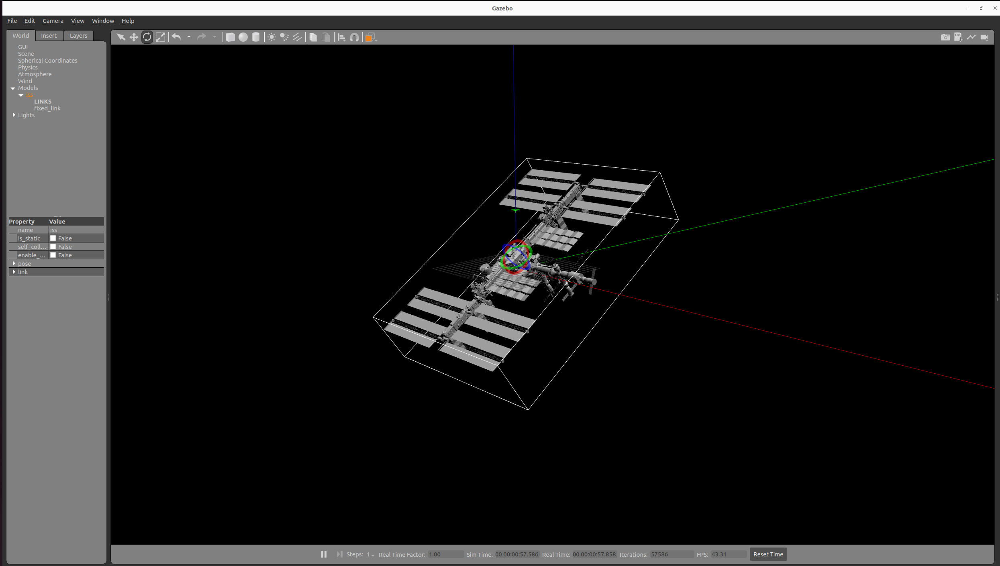

[](link_to_your_project) [](link_to_your_project) [](link_to_your_project) [](link_to_your_project)
# International Space Station in Gazebo Classic :rocket:

For the space roboticist out there, I thought it would be nice to test your model for Space Inspection Missions of orbiting structures in gazebo. This repo is a preliminary code base for the development of inspection algorithms for the ISS using ROS2 and [Gazebo Classic 11](https://classic.gazebosim.org/).




Ad astra !

## Modelling 
For distances below 400 m from the ISS, a simple double integrator model (thruster based model) will be sufficient for a realistic simulation. Although, in order to exploit passive relative manouveres, we will soon implement a simple relative dynamics model the linear time invariant [Clohessy–Wiltshire](https://www.google.com/search?q=Coloessy+wildshie+model&sca_esv=9cec5b57dbcb4293&sca_upv=1&sxsrf=ACQVn08vIs8H6A3Cy7OctcCsBG2ERLOdiw%3A1714238528264&ei=QDQtZsrRD53QwPAPlfyRsA4&ved=0ahUKEwjK8aWU9OKFAxUdKBAIHRV-BOYQ4dUDCBA&uact=5&oq=Coloessy+wildshie+model&gs_lp=Egxnd3Mtd2l6LXNlcnAiF0NvbG9lc3N5IHdpbGRzaGllIG1vZGVsMgcQIRigARgKSOoNUNMFWJIMcAF4AJABAJgBwwGgAfkGqgEDMC42uAEDyAEA-AEBmAIGoAKJB8ICCBAAGAgYDRgewgILEAAYgAQYhgMYigXCAggQABiABBiiBMICBBAhGBWYAwCIBgGSBwMwLjagB-kX&sclient=gws-wiz-serp) model or the time-varying [Yamanaka model](https://arc.aiaa.org/doi/10.2514/2.4875). Further modelling considerations including orbital perturbations will be given as the project proceeds.


## Installation 
Make sure at least Gazebo 9 is installed on your machine. The package was tested for ROS2 `humble` while other distro were not tested.

From your ROS@ workspace you can run `rosdep` to make sure that all dependancies are installed on your machine

```
rosdep install --from-paths src  --ignore-src -y
```

## Learning
For the passionate students here is a list of books and paper that will make you shine as space engineers

- [Yamanka relative dynamics model](https://arc.aiaa.org/doi/10.2514/2.4875)
- [Spacecraft Formation Flight](https://books.google.se/books/about/Spacecraft_Formation_Flying.html?id=6EidgM-aX_oC&redir_esc=y)
- [Proximity operations of formation-flying spacecraft using an eccentricity/inclination vector separation](https://scholar.google.com/citations?view_op=view_citation&hl=en&user=428U9JQAAAAJ&citation_for_view=428U9JQAAAAJ:u5HHmVD_uO8C)
- [Comprehensive survey and assessment of spacecraft relative motion dynamics models](https://scholar.google.com/citations?view_op=view_citation&hl=en&user=428U9JQAAAAJ&citation_for_view=428U9JQAAAAJ:QsKbpXNoaWkC) 
- [Information-Based Guidance and Control For On-orbit Inspection using Multiple Spacecraft.](https://www.researchgate.net/publication/344354258_Information-Based_Guidance_and_Control_For_On-orbit_Inspection_using_Multiple_Spacecraft)

# Adding new models 
The description of each model is given in the `description` folder. Each model has its own folder structure written as as

```
description
├── cubot
│   ├── meshes
│   └── urdf
│       ├── gazebo
│       │   └── model.gazebo.xacro
│       └── model
│           └── model.xacro

``` 
- The `mesh` contains the mashes of the model to be spawned in gazebo
- The `urdf` forlder (Universal Robot Description File) contains the folders `model` and `gazebo`. The `model` folder contains a single or multiple files of type `.xacro` from which  `model.xacro` is the main file to be be used for spawning. So the global model NEEDS to be defined in the  `model.xacro` which might import multiple other `.xacro` files at your will. The `gazebo` folder contains the `gazebo.xacro` files which are all the additional *gazebo specific* entries of the `model.xacro`. Usually this contains information about specific gazebo plugins or textures colors that require specific command to be set.

```diff
- It is very important that the `model.xacro` has the robot name set to be equal to the folder where the model is contained.
```
So if I have a model in the folder `description/ISS` then the `model.xacro` file has to be named `<robot name=ISS ...`. See for example

```
<?xml version="1.0"?>
<robot name="ISS" xmlns:xacro="http://ros.org/wiki/xacro">
  
  <xacro:property name="PI" value="3.1415926535897931" />
   ...

```
Once you created the model appropriately, you can built the package again and you should see your model among the found ones 


# Developers
Gregorio Marchesini [gremar@kth.se](mailto:gremar@kth.se)

Pedro Roque [padr@kth.se](padr@kth.se)


## TODO:

**Coding**

- [ ] Check that the rviz launch file is working
- [ ] Adding rough collsion model for the ISS to reduce computational burden on gazebo
- [ ] Define LTI CW model
- [ ] Include example of active collsion avoidance with a simple moving ball shaped asteroid
- [ ] Add rviz trajectory drawing 
- [ ] Implement relative dynamics


**Visual**
- [ ] Adding adding of stars/earth on the background

